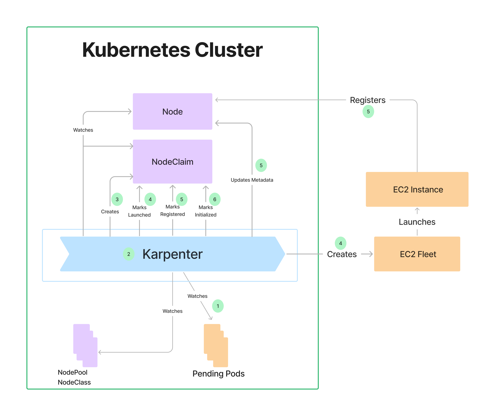

# Karpenter Installation

## Getting Started

The below installation steps are curated from [Karpenter Getting Started](https://karpenter.sh/docs/getting-started/getting-started-with-karpenter/) documentation.

#### 1. Prerequisites
- `eksctl` (>= v0.202.0) - [the CLI for AWS EKS](https://eksctl.io/installation/)
- `helm` - [the package manager for Kubernetes](https://helm.sh/docs/intro/install/)

#### (Optional)
Install [eks-node-viewer](https://github.com/awslabs/eks-node-viewer) for visualizing dynamic node usage within a cluster

```console
go install github.com/awslabs/eks-node-viewer/cmd/eks-node-viewer@latest
sudo mv -v ~/go/bin/eks-node-viewer /usr/local/bin
```

Open new terminal and run the below command for eks-node-viewer.
```console
eks-node-viewer
```

Output
```console
3 nodes (850m/5790m) 14.7% cpu ██████░░░░░░░░░░░░░░░░░░░░░░░░░░░░░░░░░░ $0.288/hour | $210.240/month 
13 pods (0 pending 13 running 13 bound)

ip-192-168-134-110.ec2.internal cpu ██████░░░░░░░░░░░░░░░░░░░░░░░░░░░░░  18% (4 pods) m5.large/$0.0960 On-Demand - Ready 
ip-192-168-161-101.ec2.internal cpu ███░░░░░░░░░░░░░░░░░░░░░░░░░░░░░░░░   8% (4 pods) m5.large/$0.0960 On-Demand - Ready 
ip-192-168-127-184.ec2.internal cpu ██████░░░░░░░░░░░░░░░░░░░░░░░░░░░░░  18% (5 pods) m5.large/$0.0960 On-Demand - Ready 
•
←/→ page • q: quit
```

#### 2. Set environment variables
```bash
export CLUSTER_NAME=$(eksctl get clusters -o json | jq -r '.[0].Name')
export AWS_REGION="ap-southeast-1"
export AWS_ACCOUNT_ID="$(aws sts get-caller-identity --query Account --output text)"
export CLUSTER_ENDPOINT="$(aws eks describe-cluster --name ${CLUSTER_NAME} --query "cluster.endpoint" --output text)"
export KARPENTER_NAMESPACE="kube-system"

echo Cluster Name:$CLUSTER_NAME AWS Region:$AWS_REGION Account ID:$AWS_ACCOUNT_ID Cluster Endpoint:$CLUSTER_ENDPOINT Karpenter Namespace:$KARPENTER_NAMESPACE
```
**Run below command to set Karpenter to the latest version available**

We will use `helm` to deploy Karpenter to the cluster. The latest Karpenter version can be found [here](https://github.com/aws/karpenter-provider-aws/releases). Set the latest version in the below command.
```bash
KARPENTER_VERSION_V=$(curl -sL "https://api.github.com/repos/aws/karpenter/releases/latest" | jq -r ".tag_name")
export KARPENTER_VERSION="${KARPENTER_VERSION_V/v}"
echo "Karpenter's Latest release version: $KARPENTER_VERSION"
```

> [!WARNING] 
> Do not proceed further without setting the environment variable $KARPENTER_VERSION to the latest Karpenter version

#### 3. Create the IAM Role and Instance profile for Karpenter Nodes

```console
TEMPOUT=$(mktemp)

curl -fsSL https://raw.githubusercontent.com/aws/karpenter-provider-aws/v"${KARPENTER_VERSION}"/website/content/en/preview/getting-started/getting-started-with-karpenter/cloudformation.yaml  > "${TEMPOUT}" \
&& aws cloudformation deploy \
  --stack-name "Karpenter-${CLUSTER_NAME}" \
  --template-file "${TEMPOUT}" \
  --capabilities CAPABILITY_NAMED_IAM \
  --parameter-overrides "ClusterName=${CLUSTER_NAME}"
```

#### 4. Add the Karpenter node role to the aws-auth configmap

Grant access to instances using the profile to connect to the cluster. This command adds the Karpenter node role to your aws-auth configmap, allowing nodes with this role to connect to the cluster.
```console
eksctl create iamidentitymapping \
  --username system:node:{{EC2PrivateDNSName}} \
  --cluster "${CLUSTER_NAME}" \
  --arn "arn:aws:iam::${AWS_ACCOUNT_ID}:role/KarpenterNodeRole-${CLUSTER_NAME}" \
  --group system:bootstrappers \
  --group system:nodes
```

You can verify the entry is now in the AWS auth map by running the following command.
```console
kubectl describe configmap -n kube-system aws-auth
```

#### 5. Create KarpenterController IAM Role

(If not already done) Before adding the IAM Role for the service account we need to create the IAM OIDC Identity Provider for the cluster.
```console
eksctl utils associate-iam-oidc-provider --cluster ${CLUSTER_NAME} --approve
```

Create a Kubernetes service account and AWS IAM Role, and associate them using IRSA to let Karpenter launch instances.
```console
eksctl create iamserviceaccount \
  --cluster "${CLUSTER_NAME}" --name karpenter --namespace $KARPENTER_NAMESPACE \
  --role-name "${CLUSTER_NAME}-karpenter" \
  --attach-policy-arn "arn:aws:iam::${AWS_ACCOUNT_ID}:policy/KarpenterControllerPolicy-${CLUSTER_NAME}" \
  --role-only \
  --approve

export KARPENTER_IAM_ROLE_ARN="arn:aws:iam::${AWS_ACCOUNT_ID}:role/${CLUSTER_NAME}-karpenter"
```

You can confirm the IAM service account has been created by running:
```console
eksctl get iamserviceaccount --cluster $CLUSTER_NAME --namespace $KARPENTER_NAMESPACE
```

#### 6. Create the EC2 Spot Service Linked Role
This step is only necessary if this is the first time you’re using EC2 Spot in this account. More details are available [here](https://docs.aws.amazon.com/batch/latest/userguide/spot_fleet_IAM_role.html).

> [!NOTE] 
> If the role has already been successfully created, you will see an error occurred (InvalidInput) when calling the CreateServiceLinkedRole operation: Service role name AWSServiceRoleForEC2Spot has been taken in this account, please try a different suffix.

```console
aws iam create-service-linked-role --aws-service-name spot.amazonaws.com || true
```

#### 7. Install Karpenter using Helm
We will use helm to deploy Karpenter to the cluster. The latest Karpenter version is already set in $KARPENTER_VERSION

```console
echo Your Karpenter version is: $KARPENTER_VERSION
helm registry logout public.ecr.aws
helm upgrade --install karpenter oci://public.ecr.aws/karpenter/karpenter --version "${KARPENTER_VERSION}" \
  --namespace "${KARPENTER_NAMESPACE}" --create-namespace \
  --set serviceAccount.annotations."eks\.amazonaws\.com/role-arn"=${KARPENTER_IAM_ROLE_ARN} \
  --set settings.clusterName=${CLUSTER_NAME} \
  --set settings.clusterEndpoint=${CLUSTER_ENDPOINT} \
  --set settings.featureGates.spotToSpotConsolidation=true \
  --set settings.interruptionQueue=${CLUSTER_NAME} \
  --set controller.resources.requests.cpu=1 \
  --set controller.resources.requests.memory=1Gi \
  --set controller.resources.limits.cpu=1 \
  --set controller.resources.limits.memory=1Gi \
  --wait
```

The command above:
- Uses the both the CLUSTER_NAME and the CLUSTER_ENDPOINT so that Karpenter controller can contact the Cluster API Server.
- Karpenter configuration is provided through a Custom Resource Definition. We will be learning about providers in the next section, the --wait notifies the webhook controller to wait until the NodePool CRD has been deployed.

Check karpenter version by using `helm list` command.
```console
helm list -n $KARPENTER_NAMESPACE
```

```console
NAME                            NAMESPACE       REVISION        UPDATED                                 STATUS          CHART                                   APP VERSION
karpenter                       kube-system     1               2024-10-02 22:20:55.584083545 +0000 UTC deployed        karpenter-1.0.5                         1.0.5
```

To check Karpenter is running you can check the Pods, Deployment and Service are Running.

To check running pods run the command below. There should be at least two pods karpenter-controller and karpenter-webhook.
```console
kubectl get pods --namespace $KARPENTER_NAMESPACE -l app.kubernetes.io/name=karpenter
```

```console
NAME                         READY   STATUS    RESTARTS   AGE
karpenter-7697c84c58-pm65x   1/1     Running   0          102s
karpenter-7697c84c58-zs4p4   1/1     Running   0          102s
```

To check the deployment run the command below. There should be only one deployment Karpenter.
```console
kubectl get deployment -n $KARPENTER_NAMESPACE -l app.kubernetes.io/name=karpenter
```

```console
NAME        READY   UP-TO-DATE   AVAILABLE   AGE
karpenter   2/2     2            2           2m20s
```

### Set up the NodePool
#### 1. Setting up a simple (default) NodePool

Let's deploy a Karpenter NodePool with the following configuration:
```console
mkdir -p ~/environment/karpenter
cd ~/environment/karpenter
cat <<EoF> default.yaml
apiVersion: karpenter.sh/v1
kind: NodePool
metadata:
  name: default
spec:
  template:
    metadata:
       labels:
          managedBy: karpenter
    spec:
      nodeClassRef:
        group: karpenter.k8s.aws
        kind: EC2NodeClass
        name: default

      expireAfter: Never

      requirements:
        - key: "karpenter.k8s.aws/instance-generation" # Filter out older instance types
          operator: Gt
          values: ["2"]
        - key: karpenter.k8s.aws/instance-category
          operator: In
          values: ["c", "m", "r"]
          minValues: 2
        - key: karpenter.k8s.aws/instance-family
          operator: In
          values: ["m6a","c6a", "r6a"]
        - key: node.kubernetes.io/instance-type
          operator: Exists
          minValues: 3
        - key: karpenter.sh/capacity-type # If not included, the webhook for the AWS cloud provider will default to on-demand
          operator: In
          values: ["on-demand", "spot"]
        - key: kubernetes.io/os
          operator: In
          values: ["linux"]
        - key: kubernetes.io/arch
          operator: In
          values: ["amd64"]

  disruption:
    consolidationPolicy: WhenEmptyOrUnderutilized
    consolidateAfter: 30s

  limits:
    cpu: "64"
    memory: "256Gi"
---
apiVersion: karpenter.k8s.aws/v1
kind: EC2NodeClass
metadata:
  name: default
spec:
  amiSelectorTerms:
    - alias: al2023@latest
  role: KarpenterNodeRole-${CLUSTER_NAME}
  securityGroupSelectorTerms:
  - tags:
      karpenter.sh/discovery: ${CLUSTER_NAME}
  - id: ${SG_ID}
  subnetSelectorTerms:
  - tags:
      karpenter.sh/discovery: ${CLUSTER_NAME}
  - id: ${SUBNET_ID}

EoF

kubectl apply -f default.yaml
```

You should see message
```console
nodepool.karpenter.sh/default created
ec2nodeclass.karpenter.k8s.aws/default created
```

#### 2. Automatic Node Provisioning
This deployment uses the [pause image](https://www.ianlewis.org/en/almighty-pause-container) and starts with zero replicas.
```console
cat <<EOF > inflate.yaml
apiVersion: apps/v1
kind: Deployment
metadata:
  name: inflate
spec:
  replicas: 1
  selector:
    matchLabels:
      app: inflate
  template:
    metadata:
      labels:
        app: inflate
    spec:
      nodeSelector:
        intent: apps
      containers:
        - name: inflate
          image: public.ecr.aws/eks-distro/kubernetes/pause:3.7
          resources:
            requests:
              cpu: 1
              memory: 1.5Gi
EOF
kubectl apply -f inflate.yaml
```

**Scale up deployment**
```console
kubectl scale deployment inflate --replicas 5
```

**Show the NodeClaims**
```console
kubectl get nodeclaims
```

**Displaying Karpenter Logs**
To read Karpenter logs from the console you can run the following command.
```console
kubectl -n $KARPENTER_NAMESPACE logs -l app.kubernetes.io/name=karpenter
```

Output
```console
{"level":"INFO","time":"2024-01-17T15:10:25.863Z","logger":"controller","message":"Starting workers","commit":"a70b39e","controller":"state.node","controllerGroup":"","controllerKind":"Node","worker count":10}
{"level":"INFO","time":"2024-01-17T15:10:25.863Z","logger":"controller","message":"Starting workers","commit":"a70b39e","controller":"state.nodeclaim","controllerGroup":"karpenter.sh","controllerKind":"NodeClaim","worker count":10}
{"level":"INFO","time":"2024-01-17T15:10:25.863Z","logger":"controller","message":"Starting workers","commit":"a70b39e","controller":"nodeclaim.consistency","controllerGroup":"karpenter.sh","controllerKind":"NodeClaim","worker count":10}
{"level":"INFO","time":"2024-01-17T15:10:25.863Z","logger":"controller","message":"Starting workers","commit":"a70b39e","controller":"metrics.nodepool","controllerGroup":"karpenter.sh","controllerKind":"NodePool","worker count":1}
{"level":"INFO","time":"2024-01-17T15:10:25.863Z","logger":"controller","message":"Starting workers","commit":"a70b39e","controller":"nodeclaim.lifecycle","controllerGroup":"karpenter.sh","controllerKind":"NodeClaim","worker count":1000}
{"level":"INFO","time":"2024-01-17T15:12:00.795Z","logger":"controller.provisioner","message":"found provisionable pod(s)","commit":"a70b39e","pods":"workshop/proddetail-d7847c958-j7mlf, workshop/proddetail-d7847c958-l6v67, workshop/proddetail-d7847c958-g9wpw, workshop/proddetail-d7847c958-8kzkj, workshop/proddetail-d7847c958-kwdbn and 2 other(s)","duration":"35.656328ms"}
{"level":"INFO","time":"2024-01-17T15:12:00.796Z","logger":"controller.provisioner","message":"computed new nodeclaim(s) to fit pod(s)","commit":"a70b39e","nodeclaims":1,"pods":7}
{"level":"INFO","time":"2024-01-17T15:12:00.830Z","logger":"controller.provisioner","message":"created nodeclaim","commit":"a70b39e","nodepool":"default","nodeclaim":"default-mt5gv","requests":{"cpu":"1550m","memory":"3584Mi","pods":"9"},"instance-types":"c1.xlarge, c3.2xlarge, c3.xlarge, c4.2xlarge, c4.xlarge and 79 other(s)"}
{"level":"INFO","time":"2024-01-17T15:12:04.252Z","logger":"controller.nodeclaim.lifecycle","message":"launched nodeclaim","commit":"a70b39e","nodeclaim":"default-mt5gv","provider-id":"aws:///us-east-1b/i-03f78ddef035230f5","instance-type":"m5a.large","zone":"us-east-1b","capacity-type":"on-demand","allocatable":{"cpu":"1930m","ephemeral-storage":"17Gi","memory":"6903Mi","pods":"29","vpc.amazonaws.com/pod-eni":"9"}}
{"level":"INFO","time":"2024-01-17T15:12:46.819Z","logger":"controller.nodeclaim.lifecycle","message":"initialized nodeclaim","commit":"a70b39e","nodeclaim":"default-mt5gv","provider-id":"aws:///us-east-1b/i-03f78ddef035230f5","node":"ip-192-168-54-42.ec2.internal"}
{"level":"INFO","time":"2024-01-17T15:10:27.234Z","logger":"controller","message":"webhook disabled","commit":"a70b39e"}
{"level":"INFO","time":"2024-01-17T15:10:27.234Z","logger":"controller.controller-runtime.metrics","message":"Starting metrics server","commit":"a70b39e"}
{"level":"INFO","time":"2024-01-17T15:10:27.234Z","logger":"controller.controller-runtime.metrics","message":"Serving metrics server","commit":"a70b39e","bindAddress":":8000","secure":false}
{"level":"INFO","time":"2024-01-17T15:10:27.234Z","logger":"controller","message":"starting server","commit":"a70b39e","kind":"health probe","addr":"[::]:8081"}
{"level":"INFO","time":"2024-01-17T15:10:27.335Z","logger":"controller","message":"attempting to acquire leader lease karpenter/karpenter-leader-election...","commit":"a70b39e"}
```

**How the node created by Karpenter ?**

### NodeClaim roles in node creation

NodeClaims provide a critical role in the Karpenter workflow for provisioning capacity, and in node disruptions.

The following diagram illustrates how NodeClaims interact with other components during Karpenter-driven node creation.



#### 3. Clean up
Below commands will remove karpenter setup
```console
export CLUSTER_NAME=$(eksctl get clusters -o json | jq -r '.[0].Name')
kubectl delete nodepools.karpenter.sh default
kubectl delete ec2nodeclasses.karpenter.k8s.aws default

helm uninstall karpenter --namespace $KARPENTER_NAMESPACE

eksctl delete iamserviceaccount \
  --cluster ${CLUSTER_NAME} \
  --namespace $KARPENTER_NAMESPACE \
  --name karpenter \
  --wait
eksctl delete iamserviceaccount   \
 --name ebs-csi-controller-sa   \
 --namespace kube-system \
 --cluster $CLUSTER_NAME \
 --wait

aws ec2 describe-launch-templates \
    | jq -r ".LaunchTemplates[].LaunchTemplateName" \
    | grep -i Karpenter-${CLUSTER_NAME} \
    | xargs -I{} aws ec2 delete-launch-template --launch-template-name {}
    
```

Output
```console
...
nodepool.karpenter.sh "default" deleted
...
ec2nodeclass.karpenter.k8s.aws "default" deleted
...
...
release "karpenter" uninstalled
...
2024-01-17 15:18:41 [ℹ]  1 iamserviceaccount (karpenter/karpenter) was included (based on the include/exclude rules)
2024-01-17 15:18:41 [ℹ]  1 task: { 
    2 sequential sub-tasks: { 
        delete IAM role for serviceaccount "karpenter/karpenter" [async],
        delete serviceaccount "karpenter/karpenter",
    } }2024-01-17 15:18:41 [ℹ]  will delete stack "eksctl-eksworkshop-eksctl-addon-iamserviceaccount-karpenter-karpenter"
2024-01-17 15:18:41 [ℹ]  serviceaccount "karpenter/karpenter" was already deleted
```