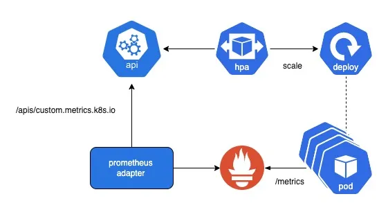

# Prometheus Custom Metrics

## Getting Started
This project will give instructions on configuring `HPA` to autoscale based on custom metrics which is HTTP requests per second.

Before we can make it work, we need to set up `Prometheus Operator`, it will help to create `CRDs` and provision Prometheus instance and manage other components (Alertmanager, ServiceMonitor, PodMonitor,...)

We do that first because we will don't need to add an configuration for each of resource mannually anymore. Instead it will use `PodMonitor` and `ServiceMonitor` objects to dynamically generates the relevant configuration for the Prometheus server to monitor them.

Then we launch `Prometheus Adapter` to serves the custom metrics API in order to make a communicate between Kubernetes and Prometheus. Be-hind the scense it will do a series of query metrics on Prometheus that match with custom metric name we defined in `HPA`.

### Prerequisites

- Kubernetes 1.19+
- Helm 3+
- Prometheus-Operator
- Prometheus-Adapter

### Install Using Helm Chart

Install the [Kube-Prometheus-Stack](https://github.com/prometheus-community/helm-charts/tree/main/charts/kube-prometheus-stack) helm chart which provides a collection of Kubernetes manifests, [Grafana](https://grafana.com/) dashboards, and [Prometheus rules](https://prometheus.io/docs/prometheus/latest/configuration/recording_rules/) combined with documentation and scripts to provide easy to operate end-to-end Kubernetes cluster monitoring with [Prometheus](https://prometheus.io/) using the Prometheus Operator.

To see more details, please check the [chart's README](https://github.com/prometheus-community/helm-charts/tree/main/charts/kube-prometheus-stack#kube-prometheus-stack).

> This Helm chart is no longer part of Prometheus-Operator and is now maintained by [Prometheus Community Helm Charts](https://github.com/prometheus-community/helm-charts).